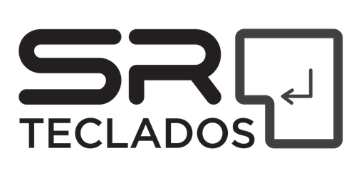

 

  

# ClackBot

> Robô para fidelidade e sorteios no Twitch

## Bot

A idéia é que os viewers do canal possam acumular ponto por fidelidade. Ao longo das streams, o sistema irá gerar notificações em intervalos aleatórios. Cada usuário no chat deve reagir com um comando `!pegar` para acumular os pontos desse intervalo. Quando um usuário subscreve ao canal, mais tokens são adicionados. O mesmo se dá com gift subs, bits, etc.

O nome dos pontos de fidelidade do canal será clacks. No canal mostraremos um leaderboard de clacks. Além disso, nos giveaways todo usuário que estiver na live do sorteio poderá participar com um token, mas usuários fidelizados poderão trocar clacks por tokens para o sorteio.

Todo usuário poderá controlar seus pontos através de um comando específico `!clacks`. Usuários também poderão doar pontos para outros através do comando `!doar <usuario> <pontos>`.

Certos eventos gerarão clacks para os usuários, da seguinte forma:

| Meio     | Ação         | Clacks |
|----------|--------------|--------|
| Twitch   | Follow       | 10     |
| Twitch   | Subscribe    | 100    |
| Twitch   | `!pegar` com espontânea em intervalos randômicos (15-30min)  | 30-200 |
| Twitch   | `!pegar` ao final do stream | 20 |
| Discord  | `+clack @usuario` como agradecimento por uma dica | +2 para quem recebe, -1 para quem doa |

Assinantes do Twitch terão um multiplicador de 2x quando uma ação ocorrer. Por exemplo, ao `!pegar` um randômico de 40 clacks, o usuário será creditado com 80.

## Leaderboard

Será um widget que será exibido durante as lives.

## Misc

URL para obter tokens: https://id.twitch.tv/oauth2/authorize?client_id=&redirect_uri=http://localhost=&response_type=token&scope=channel:moderate+chat:edit+chat:read
